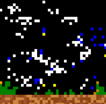

# READ ME

# APPLICATION : Bac à sables

## ================== Presentation
###### On utilise ici le TP Jeu de la vie
###### V 1.1 FARAH BOUHNAIDA Avril 2024
###### p2208997
###### Mise à jour le 19/04/2024
###### C5
###### Pas de toucbe
## Bienvenue sur le code de simulation du bac à sable en C++ !

Ce programme a été conçu pour simuler un monde d'elements en utilisant les lois de 
la physique sur des elements selon leurs types.
Chaque case est comparé à ses cases voisines à l'aide d'une double boucle (1 pour les x et 1 pour les y)
si les conditions proposé à l'aide des "if" sont valides alors la case change (etat : 1, 2...) 

Note : pas de touches utilisés.

Si vous avez des questions ou des commentaires, n'hésitez pas à m'envoyez un mail.

Bonne simulation de bac à sable !

## ==================  HISTORIQUE

* 01/04 > Semaine 1 
*       Verification du fonctionnement du TP particule 
        + création du Read me.
* 08/04 > Semaine 2
*       passage d'une particule à une grille d'etat 
        + init + debut de la simulation (etat aire liquide, gaz, solide) (4 etats en tous)
* 15/04 > Semaine 3
*       debut de la simulation
        + update + ajout d'etat dans la simulation (plante, abeille, lave..) (7 etats possibles en tous)
	+ fonctions annexes
### structures
* element
* world

### Fonctions annexes

* operator color 
* etat : permet de connaitre l'etat et met à jour la couleur en cas de changement
* newetat : change l'etat d'un element 
* contactinter : permet de verifier s'il y a un changement au contact d'un autre element dans une position quelconque
* initgrille : initialise une grille de terre et aire
* collision : test des elements d'un etat avec les autres autour de lui (ex : eau + terre = plante) 

### Fonctions principales

1. initw : initialise un monde
2. draww : dessine un monde
3. updatew : met à jour un monde

### ETATS existants
0. aire    1. gaz     2. liquide 
3. solide  4. plante  5. terre   
6. mort    8. abeille 9. fleur

### references
Pas de references utilisé sauf le jeu de la vie de lifami.

## Images

